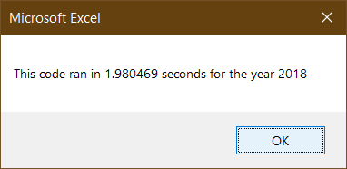
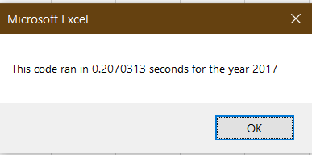
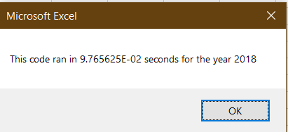

# Green Stock Analysis 

## Overview of Project

Analysis of "Green Stocks" using Visual Basic on Excel.  

### Purpose

Run scripts to check total volume and return values of *"Green Stocks"* for a specified year. Compared runtime of code before and after refactoring.

## Analysis and Challenges

### Original code

Original subscripts for analysis of stocks ran nested loops. The outer loop runs through each ticker of the array, established as "tickers(i)", and the inner loop runs through the rows of data of the reference sheet. 

>
	For i = 0 To 11 
	    ticker = tickers(i)
            totalVolume = 0
            
            Sheets(yearValue).Activate
            
            For j = 2 To RowCount
         
                If Cells(j, 1).Value = ticker Then
                    
                    totalVolume = totalVolume + Cells(j, 8).Value
                
                End If
                
                If Cells(j - 1, 1).Value <> ticker And Cells(j, 1).Value = ticker Then
                    
                    startingPrice = Cells(j, 6).Value
                
                End If
                    
                If Cells(j + 1, 1).Value <> ticker And Cells(j, 1).Value = ticker Then
                    
                    endingPrice = Cells(j, 6).Value
                    
                End If
                    
            Next j
  	
	Next i

These subscripts run around 1.79 seconds for All Stocks in 2017 and around 1.98 seconds for All Stocks in 2018

### Refactored code

The refactored code contains 3 arrays that loop once through the code.  A **tickerIndex** was added into the newly created arrays to simplify the loop:
>
 	For i = 2 To RowCount
        
            tickerVolume(tickerIndex) = tickerVolume(tickerIndex) + Cells(i, 8).Value
        
            If Cells(i - 1, 1).Value <> tickers(tickerIndex) And Cells(i, 1).Value = tickers(tickerIndex) Then
        
            tickerStartingPrices(tickerIndex) = Cells(i, 6).Value
        
            End If
         
            If Cells(i + 1, 1).Value <> tickers(tickerIndex) And Cells(i, 1).Value = tickers(tickerIndex) Then
            
            tickerEndingPrices(tickerIndex) = Cells(i, 6).Value
          
            tickerIndex = tickerIndex + 1
            
            End If
    	
	Next i

The refactored code ran in about .21 and .01 seconds for All Stocks in 2017 and 2018, respectively.

## Results

- Refactored code shows incredible efficiency, as shown in by a drastic reduction in run time. Refactoring also allows for quick and easy additions without overcomplicating the code.  This project only has three parameters, but the addition of a tickerIndex can facilitate the addition of more parameters (such as Quarter Value, Ratios, etc.)

-One potential drawback to refactoring code lies in how effectively the code is explained for outside programmers to follow. If the code becomes too complicated and is poorly explained, it may be hard for it to maintain its function. This could result in erroneous results and could potential be more costly to fix.    
